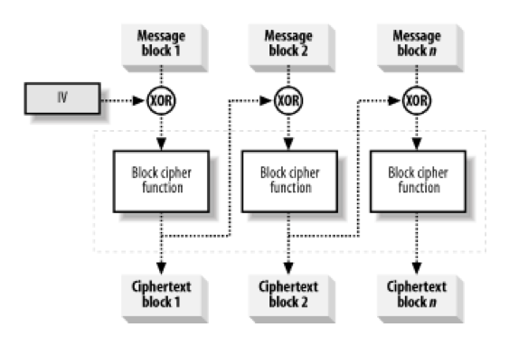
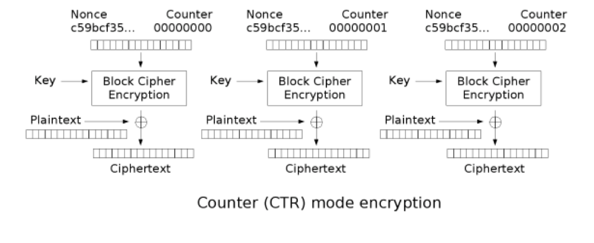

Symmetric Encryption
====================

Scapi implements three main categories of symmetric encryption:

1. An encryption based on modes of operation using a pseudo-random permutation and a randomized IV. The randomized IV is crucial for security. **CBCEnc** and **CTREnc** belong to this category.

2. An authenticated encryption where the message gets first encrypted and then mac-ed. **EncryptThenMac** belongs to this category.

3. Homomorphic encryption. Even though we do not currently implement any concrete homomorphic encryption, we provide the interfaces for future possible implementations.

The symmetric encryption family of classes implements three main functionalities that correspond to the cryptographer’s language in which an encryption scheme is composed of three algorithms:

1. Generation of the key.

2. Encryption of the plaintext.

3. Decryption of the ciphertext.

.. note:: We note that for authenticated encryption, two secret keys will be used, one for the encryption and one for the authentication.

.. contents::

The SymmetricEnc Interface
--------------------------

.. java:type:: public interface SymmetricEnc extends Eav, Indistinguishable
   :package: edu.biu.scapi.midLayer.symmetricCrypto.encryption

   This is the main interface for the Symmetric Encryption family.
   Any symmetric encryption scheme belongs by default at least to the Eavsdropper Security Level and to the Indistinguishable Security Level.

Encryption and Decryption
~~~~~~~~~~~~~~~~~~~~~~~~~

.. java:method:: public SymmetricCiphertext encrypt(Plaintext plaintext)
   :outertype: SymmetricEnc

   Encrypts a plaintext. It lets the system choose the random IV.

   :param plaintext:
   :throws IllegalArgumentException: if the given plaintext does not match this encryption scheme.
   :throws IllegalStateException: if no secret key was set.
   :return: an IVCiphertext, which contains the IV used and the encrypted data.

.. java:method:: public SymmetricCiphertext encrypt(Plaintext plaintext, byte[] iv) throws IllegalBlockSizeException
   :outertype: SymmetricEnc

   This function encrypts a plaintext. It lets the user choose the random IV.

   :param plaintext:
   :param iv: random bytes to use in the encryption pf the message.
   :throws IllegalArgumentException: if the given plaintext does not match this encryption scheme.
   :throws IllegalBlockSizeException: if the given IV length is not as the block size.
   :throws IllegalStateException: if no secret key was set.
   :return: an IVCiphertext, which contains the IV used and the encrypted data.

.. java:method:: public Plaintext decrypt(SymmetricCiphertext ciphertext)
   :outertype: SymmetricEnc

   This function performs the decryption of a ciphertext returning the corresponding decrypted plaintext.

   :param ciphertext: The Ciphertext to decrypt.
   :throws IllegalArgumentException: if the given ciphertext does not match this encryption scheme.
   :throws IllegalStateException: if no secret key was set.
   :return: the decrypted plaintext.

Key Generation
~~~~~~~~~~~~~~

.. java:method:: public SecretKey generateKey(AlgorithmParameterSpec keyParams) throws InvalidParameterSpecException
   :outertype: SymmetricEnc

   Generates a secret key to initialize this symmetric encryption.

   :param keyParams: algorithmParameterSpec contains parameters for the key generation of this symmetric encryption.
   :throws InvalidParameterSpecException: if the given keyParams does not match this symmetric encryption.
   :return: the generated secret key.

.. java:method:: public SecretKey generateKey(int keySize)
   :outertype: SymmetricEnc

   Generates a secret key to initialize this symmetric encryption.

   :param keySize: is the required secret key size in bits.
   :return: the generated secret key.

Key Handling
~~~~~~~~~~~~

.. java:method:: public boolean isKeySet()
   :outertype: SymmetricEnc

   An object trying to use an instance of symmetric encryption needs to check if it has already been initialized.

   :return: true if the object was initialized by calling the function setKey.

.. java:method:: public void setKey(SecretKey secretKey) throws InvalidKeyException
   :outertype: SymmetricEnc

   Sets the secret key for this symmetric encryption. The key can be changed at any time.

   :param secretKey: secret key.
   :throws InvalidKeyException: if the given key does not match this encryption scheme.

The CBCEnc Interface
--------------------

These is a  marker interface, for the CBC method:

.. java:type:: public interface CBCEnc extends SymmetricEnc, Cpa
   :package: edu.biu.scapi.midLayer.symmetricCrypto.encryption

The CTREnc Interface
--------------------

These is a  marker interface, for the CTR method:

.. java:type:: public interface CTREnc extends SymmetricEnc, Cpa
   :package: edu.biu.scapi.midLayer.symmetricCrypto.encryption

Basic Usage
-----------

Sender usage:

.. code-block:: java

    //Create an encryption object. The created object is a CTR-AES encryption scheme object.
    SymmetricEnc encryptor = new ScCTREncRandomIV("AES");

    //Generate a SecretKey using the created object and set it.
    SecretKey key = encryptor.generateKey(128); 
    encryptor.setKey(key);

    //Get a plaintext to encrypt, and encrypt the plaintext.
    ...
    SymmetricCiphertext cipher = Encryptor.encrypt(plaintext); 

    //Send the cipher to the decryptor.
    ...

Receiver usage:

.. code-block:: java

    //Create the same SymmetricEnc object as the sender’s encryption object, and set the key.
    //Get the ciphertext and decrypt it to get the plaintext.
    Plaintext plaintext = decryptor.decrypt(cipher);

The AuthenticatedEnc Interface
------------------------------

.. java:type:: public interface AuthenticatedEnc extends SymmetricEnc, Cca2
   :package: edu.biu.scapi.midLayer.symmetricCrypto.encryption

.. java:type:: public class ScEncryptThenMac implements AuthenticatedEnc
   :package: edu.biu.scapi.midLayer.symmetricCrypto.encryption

   This class implements a type of authenticated encryption: encrypt then mac.

   The encryption algorithm first encrypts the message and then calculates a mac on the encrypted message.

   The decrypt algorithm receives an encrypted message and a tag. It first verifies the encrypted message with the tag. If verifies, then it proceeds to decrypt using the underlying decrypt algorithm, if not returns a null response.

   This encryption scheme achieves Cca2 and NonMalleable security level.

Basic Usage
~~~~~~~~~~~

.. code-block:: java

    //Create the PRP that is used by the encryption object.
    AES aes = new BcAES();
    
    //Create encryption object.
    SymmetricEnc enc = new ScCTREncRandomIV(aes);
    
    //Create the PRP that is used by the Mac object.
    TripleDES tripleDes = new BcTripleDES(); 
    
    //Create Mac object.
    Mac cbcMac = new ScCbcMacPrepending(tripleDes);

    //Create the encrypt-then-mac object using encryption and authentication objects. 
    ScEncryptThenMac encThenMac = new ScEncryptThenMac(enc, cbcMac);
    
    // prepare the plaintext
    Plaintext plaintext;
    ...

    // encrypt
    SymmetricCiphertext cipher = encThenMac.encrypt(plaintext);

    // decrypt
    Plaintext decrypted = encThenMac.decrypt(cypher);
