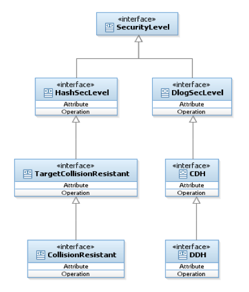

Security Levels
===============

In many cases, a cryptographic primitive is not just "secure" or "insecure". Rather, it may meet some notion of security and not another. A classic example is encryption, where a scheme can be secure in the presence of eavesdropping adversaries (EAV), in the presence of chosen-plaintext attacks (CPA) or in the presence of chosen-ciphertext attacks (CCA). These three levels of security also form a hierarchy (any scheme that is secure in the presence of chosen-ciphertext attacks, is secure against chosen-plaintext attacks and so on). The choice of which level of security to require, depends on the application. We remark that it is not always wise to take the "most secure" scheme since this sometimes comes with a performance penalty. In addition, in some cases (like in commitments), the security levels are non-comparable. 

Protocols that by definition need to work with primitives that hold a specific security level are responsible for checking that the primitives meet the security level requirements. For example, an encryption scheme that is secure under DDH should check that it receives a Dlog Group with security level ``DDH``.

The library therefore includes a hierarchy of security level interfaces; specifically in this layer for ``DlogGroup`` and ``CryptographicHash`` families. These interfaces have no methods and are only marker interfaces. Each concrete class that is based on any security level should implement the relevant interface, to declare itself as secure as the marker interface.

